# FARIC Music Graph — Android APK Delivery Contract

Updated: 2026-09-28

## Product target

The final user-facing deliverable is an Android APK.

Web/PWA remains a development and test surface.

## Packaging decision gate

Preferred first packaging experiment:
- accepted web/PWA graph UI;
- Android shell / Capacitor or equivalent WebView packaging;
- native bridge only for concrete platform needs.

Switch to a more native renderer only if measured requirements justify it:
- WebGL/WebView performance;
- memory;
- lifecycle restoration;
- file/storage integration;
- touch behavior;
- background work.

## Android baseline

Before Android scaffold:
- verify current Android Gradle Plugin/Kotlin/AndroidX/Capacitor versions from current public docs;
- do not copy dependency versions from sibling projects blindly.

Reusable tested principles from YTM/Renault:
- stable development signing identity;
- production key never committed;
- safe insets;
- ~48dp critical touch targets;
- rotation restores state without repeating actions;
- system Back and visual Back tested separately;
- CI/build PASS is separate from phone PASS.

## Signing isolation

Music Graph must have its **own** development signing certificate.

Never reuse:
- YTM keystore;
- Renault keystore;
- production signing material from another project.

Production release key/passwords live only in secure CI secrets or an explicitly approved secure signing workflow.

## Signed APK pipeline

Target GitHub Actions flow:

```mermaid
flowchart LR
  C[Exact source commit] --> P[Preflight]
  P --> T[Unit / schema / UI tests]
  T --> B[Android release build]
  B --> S[Sign]
  S --> V[apksigner verify]
  V --> Z[zipalign verify]
  Z --> M[aapt/package metadata]
  M --> H[SHA-256]
  H --> A[GitHub artifact]
  A --> I[Phone install]
  I --> Q[Real-phone QA]
```



## Artifact naming

Target:

```text
FARIC-Music-Graph-vX.Y.Z-release.apk
FARIC-Music-Graph-vX.Y.Z-release.apk.sha256
```

Stable phone folder:

```text
/storage/emulated/0/Documents/FARIC-Music-Graph/artifacts/apk/FARIC-Music-Graph-vX.Y.Z-build/
```

Do not scatter APKs in arbitrary Download roots.

## Three different version states

Track separately:
1. repository source/version;
2. signed build source + CI run;
3. phone-installed/tested version.

Do not call a build the current phone app until the user actually installs it.

## APK handoff gate

After successful signed build:
1. identify exact source SHA and Actions run;
2. retrieve APK + checksum;
3. verify checksum;
4. place both in the stable versioned phone folder;
5. user installs;
6. record installed version;
7. execute phone QA;
8. only then claim phone PASS.

## Security

Release preflight eventually blocks:
- tracked production keystore;
- signing passwords/properties;
- OAuth tokens;
- API secrets;
- unexpected package ID/version;
- missing apksigner verification;
- missing zipalign verification;
- missing SHA-256.

## Lifecycle requirement for Nested 3D Worlds

Android recreation/rotation must restore:
- drill path;
- current scope;
- selected node;
- expand/collapse state;
- applied filters;
- draft filters if filter panel is open;
- panel open/closed state;
- camera/orbit/zoom when practical;
- Track detail state.

Restoration must never repeat a channel write/import/destructive action.
