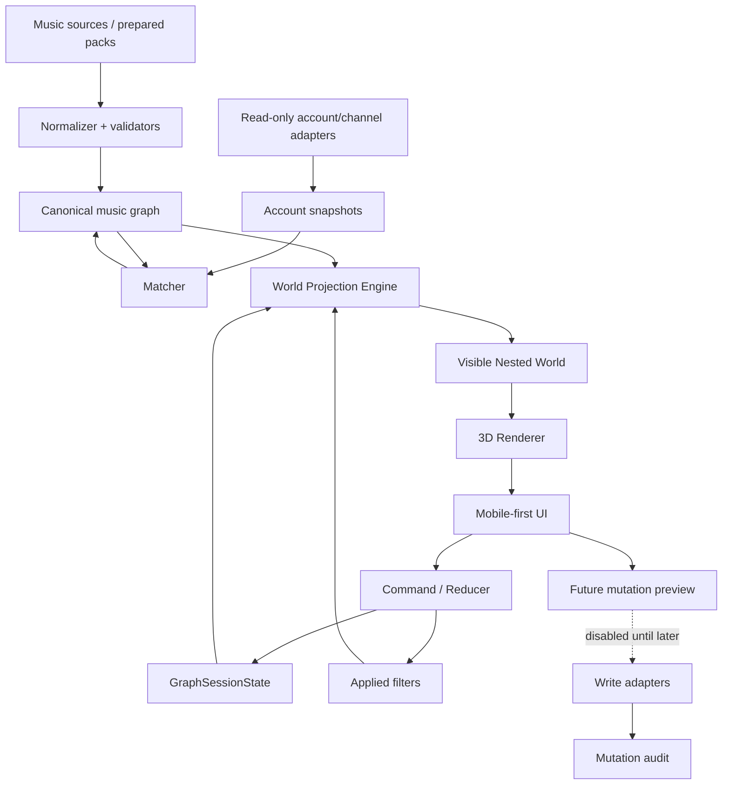

# Architecture

Updated: 2026-09-28

## High-level product architecture

## Product navigation

Primary projection:
`Universe → Account → Year → Genre → Artist → Release → Track`.

This is a navigation projection only.

## Renderer separation

The renderer is replaceable.

Semantic state, command behavior and projection logic must be testable without WebGL.

This allows:
- Canvas prototype now;
- Three.js/WebGL later;
- 2D debug/fallback renderer;
- Android WebView/Capacitor packaging without rewriting business state.

## State layers

1. canonical graph data;
2. account/channel snapshots;
3. GraphSessionState;
4. draft/applied filters;
5. projected visible world;
6. renderer/camera;
7. UI overlays.

Do not collapse these into one mutable rendering object.

## Android direction

Final product is a signed APK.

Initial packaging candidate:
- accepted web UI + Android shell/Capacitor/WebView.

Native Kotlin/Compose or native renderer is chosen only if measured requirements justify it.

APK contract:
`docs/android/APK_DELIVERY_CONTRACT.md`.

## Provenance / identity

Every imported source preserves provenance.

Titles are not stable IDs.

External IDs are opaque.

## YouTube boundary

Read and write adapters are separate.

Write remains absent/disabled until the read-only graph/account model and preview contract are accepted.
