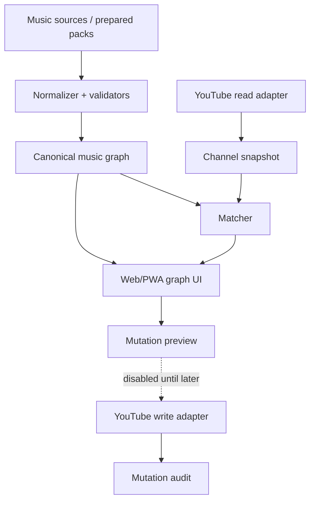

# Architecture

## Canonical graph

Folders are views, not truth. A track can belong to multiple releases and have multiple variants.

Entities:
- Artist;
- Release;
- Track;
- TrackVersion;
- Genre;
- Year;
- YouTubeItem;
- Playlist;
- Snapshot;
- AuditEvent.

Important edges:
- ARTIST_HAS_RELEASE;
- RELEASE_HAS_TRACK;
- VERSION_OF;
- REMIX_OF;
- LIVE_VERSION_OF;
- DEMO_OF;
- MATCHES_YOUTUBE_ITEM;
- ITEM_IN_PLAYLIST.

## Implementation direction

v0.x: static/local-first web app with generated JSON.

Production web/PWA candidate:
- TypeScript;
- React + Vite;
- Graphology;
- Sigma.js;
- IndexedDB;
- schema validation;
- Playwright + Vitest.

Verify current dependency versions at scaffold time.

Android: package the accepted web/PWA with Capacitor first; choose native Kotlin/Compose only for a measurable unmet requirement.

## YouTube boundary

Read and write adapters are separate. Write adapter remains absent/disabled until the write contract is accepted and tested.

## Provenance

Every imported release/list should preserve source package/file, source type, import timestamp, confidence/verification state and external IDs when available.

Titles alone are not stable identifiers.
