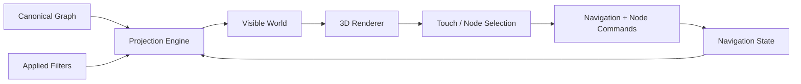
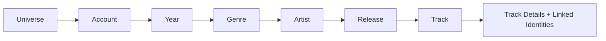
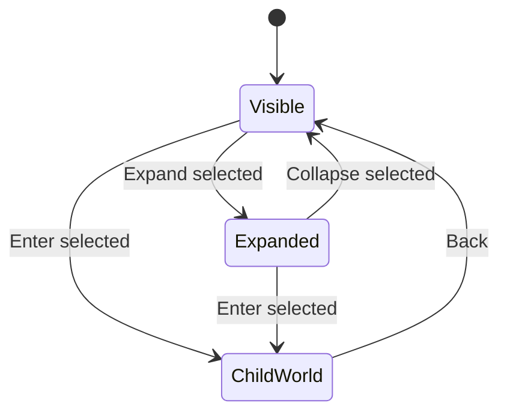
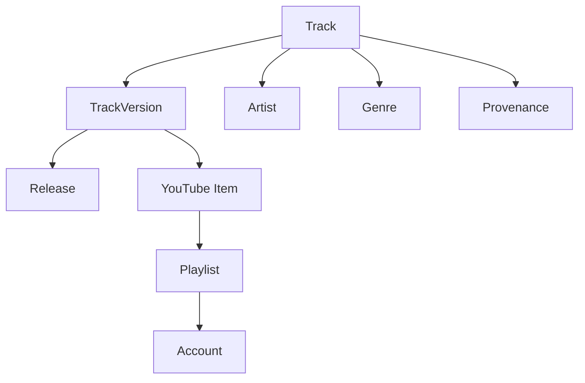

# Nested 3D Worlds Architecture

Updated: 2026-09-28

## Architecture rule

The full canonical graph and the visible 3D world are different things.



The renderer must not become the source of truth.

## Core state

Minimum semantic state:

```ts
GraphSessionState {
  drillPath: NodeRef[]
  currentScope: NodeRef
  selectedNode: NodeRef | null
  expandedNodeIds: Set<NodeId>
  collapsedNodeIds: Set<NodeId>

  draftFilters: FilterState
  appliedFilters: FilterState

  camera: CameraState
  rendererMode: RendererMode

  inspector: InspectorState
}
```

This state is serializable/restorable except transient pointer/animation details.

## Primary drill projection

Initial primary path:



This sequence is a view contract, not a claim that the canonical graph has only parent-child edges.

## World projection

Given:
- current scope;
- drill level;
- applied filters;
- expand/collapse state;

the Projection Engine returns:
- visible nodes;
- visible edges;
- node roles;
- contextual actions;
- contextual filters;
- predicted node count;
- breadcrumb metadata.

The renderer receives only this projection.

## Command model

Commands should be renderer-independent:

- `SELECT_NODE(id)`
- `EXPAND_NODE(id)`
- `COLLAPSE_NODE(id)`
- `EXPAND_ALL(scope)`
- `COLLAPSE_ALL(scope)`
- `ENTER_NODE(id)`
- `BACK_SCOPE`
- `HOME_SCOPE`
- `FIT_VIEW`
- `SET_DRAFT_FILTER(key,value)`
- `RESET_DRAFT_FILTERS`
- `APPLY_FILTERS`

This allows the same logic to be tested without WebGL.

## Expand vs Enter



Expand changes visibility inside the same scope.

Enter changes scope and drill path.

## Account universe

Add a provider-neutral Account entity.

Suggested fields:
- id;
- provider;
- externalAccountId / channelId when available;
- displayName;
- handle;
- publicUrl;
- status;
- provenance;
- lastInventoryAt.

Authentication/token data is not stored in canonical graph files.

Suggested edges:
- `ACCOUNT_HAS_PLAYLIST`;
- `ACCOUNT_HAS_ITEM`;
- `ACCOUNT_MATCHES_TRACK_VERSION`;
- optional explicit `RELATED_ACCOUNT`.

The Universe can show account nodes and safe cross-account relationships.

## Track details aggregation

Track terminal details are built by traversing the canonical graph from the selected Track / TrackVersion.



The UI presents grouped facts but keeps stable IDs internally.

## Performance guard

A nested world is intended to keep the visible set small.

Still, commands such as Expand All can expose many nodes.

Before expensive expansion:
1. estimate visible node/edge count;
2. if below tested threshold, apply immediately;
3. if above threshold, progressively render or ask for confirmation;
4. preserve Cancel as no-op.

Thresholds are measured on the real target phone, not guessed permanently in documentation.

## Renderer strategy

v0.1.x Canvas remains prototype evidence.

v0.2+ should separate semantic graph state from renderer.

Candidate production renderers:
- Three.js / a 3D force/spherical layer for Nested 3D Worlds;
- Graphology as graph data/algorithm layer where useful;
- a 2D WebGL renderer as debug/fallback/overview mode.

No renderer is accepted as production merely because its demo looks good. Phone gesture quality, full-seed FPS, memory, heat and APK WebView behavior decide.
