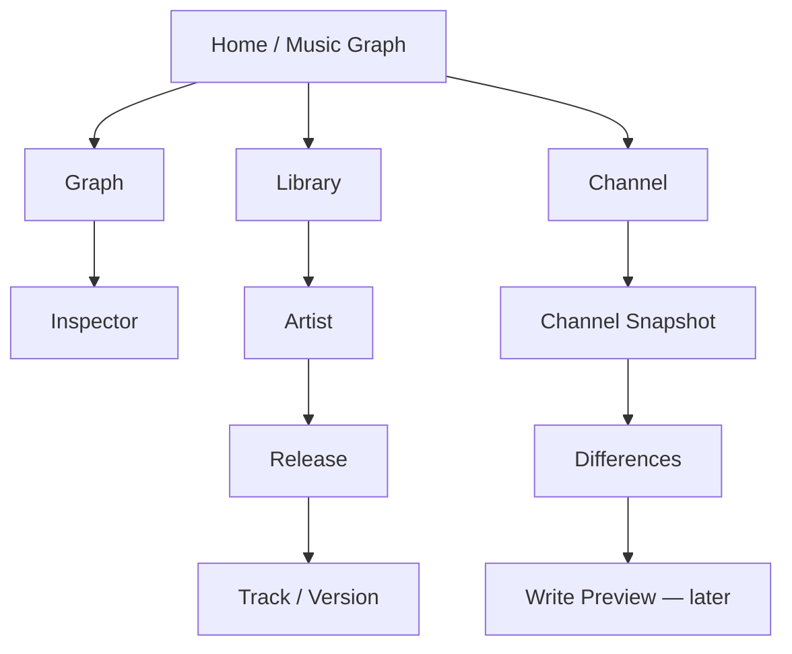

# Blueprint застосунку

Graph modes:
- повний граф;
- тільки виконавець;
- тільки альбом;
- рік → жанр → виконавець → реліз → трек;
- remix map;
- channel coverage.

Натискання на вузол відкриває inspector. Окрема дія ізолює гілку. Breadcrumb повертає вище без втрати фільтрів.

Перший Channel milestone — тільки читання: snapshot, inventory, match/missing/duplicate/review.

Кнопок, що змінюють канал, у read-only milestone немає.
