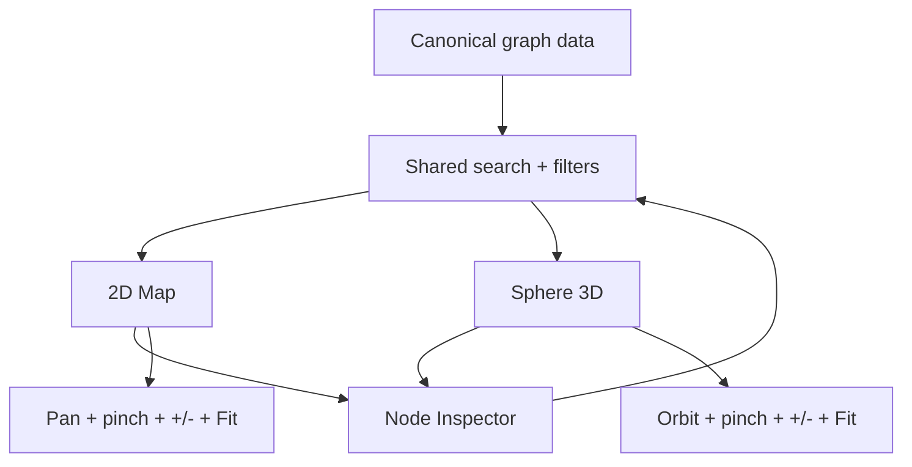

# v0.1.1 Interaction Diagram

```mermaid
flowchart TD
  D[Canonical graph data] --> F[Shared search + filters]
  F --> M[2D Map]
  F --> S[Sphere 3D]
  M --> I[Node Inspector]
  S --> I
  M --> Z[Pan + pinch + +/- + Fit]
  S --> O[Orbit + pinch + +/- + Fit]
  I --> F
```

Switching view changes presentation only; canonical data and filters remain shared.
