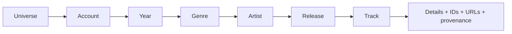
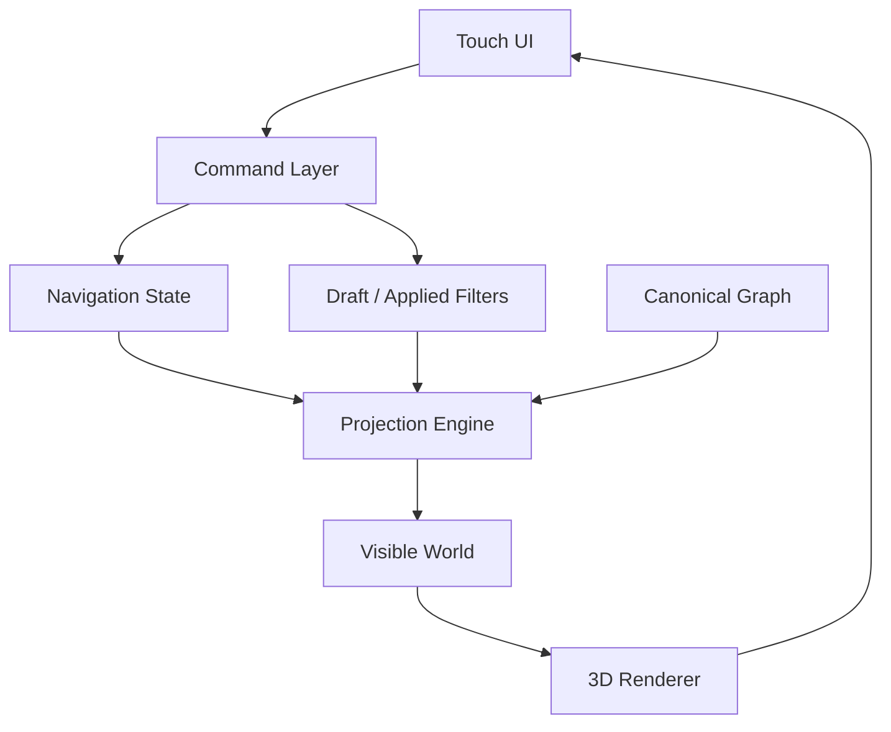
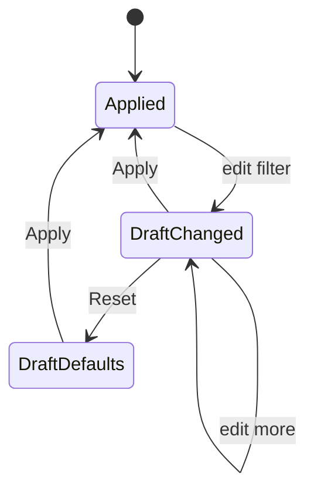
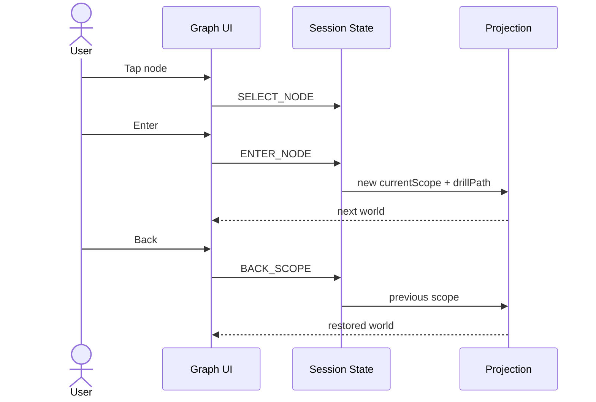

# v0.2.0 Diagrams

## Product navigation

```mermaid
flowchart LR
  U[Universe] --> A[Account]
  A --> Y[Year]
  Y --> G[Genre]
  G --> AR[Artist]
  AR --> R[Release]
  R --> T[Track]
  T --> D[Details + IDs + URLs + provenance]
```

## UI/state architecture

```mermaid
flowchart TB
  UI[Touch UI] --> CMD[Command Layer]
  CMD --> NS[Navigation State]
  CMD --> FS[Draft / Applied Filters]
  NS --> PROJ[Projection Engine]
  FS --> PROJ
  CG[Canonical Graph] --> PROJ
  PROJ --> WORLD[Visible World]
  WORLD --> RENDER[3D Renderer]
  RENDER --> UI
```

## Filter apply lifecycle

```mermaid
stateDiagram-v2
  [*] --> Applied
  Applied --> DraftChanged: edit filter
  DraftChanged --> DraftChanged: edit more
  DraftChanged --> Applied: Apply
  DraftChanged --> DraftDefaults: Reset
  DraftDefaults --> Applied: Apply
```

## Back / Enter

```mermaid
sequenceDiagram
  actor U as User
  participant UI as Graph UI
  participant S as Session State
  participant P as Projection
  U->>UI: Tap node
  UI->>S: SELECT_NODE
  U->>UI: Enter
  UI->>S: ENTER_NODE
  S->>P: new currentScope + drillPath
  P-->>UI: next world
  U->>UI: Back
  UI->>S: BACK_SCOPE
  S->>P: previous scope
  P-->>UI: restored world
```
